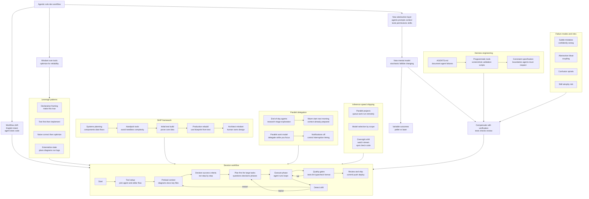

[← Back to Topic](README.md) | [← Home](../../README.md)

# Solo Developer Workflow

## Index

- [The Workflow Shift](#the-workflow-shift)
- [The New Abstraction Layer](#the-new-abstraction-layer)
  - [The Mental Model Challenge](#the-mental-model-challenge)
    - [The Pellet Gun / Laser Beam Experience](#the-pellet-gun--laser-beam-experience)
  - [The Skill Gap Reality](#the-skill-gap-reality)
  - [Legacy Assumptions Paradox](#legacy-assumptions-paradox)
- [Mindset Over Tools](#mindset-over-tools)
- [Designer Notes](#designer-notes)
- [Session Workflow](#session-workflow)
  - [Tool Setup](#tool-setup)
  - [Preloading Context with Diagram Files](#preloading-context-with-diagram-files)
  - [Automation: Aliases, CLIs, and Hooks](#automation-aliases-clis-and-hooks)
  - [Handling Drift](#handling-drift)
  - [Large-Project Workflow (Plan-First)](#large-project-workflow-plan-first)
- [End-of-Day Agents](#end-of-day-agents)
  - [Effective End-of-Day Tasks](#effective-end-of-day-tasks)
  - [The Warm Start Effect](#the-warm-start-effect)
- [Parallel Delegation Model](#parallel-delegation-model)
  - [Notification Discipline](#notification-discipline)
  - [Trust Thresholds](#trust-thresholds)
- [Harness Engineering](#harness-engineering)
  - [AGENTS.md as Living Documentation](#agentsmd-as-living-documentation)
  - [Programmatic Verification Tools](#programmatic-verification-tools)
- [Example: Agentic ML Experimentation](#example-agentic-ml-experimentation-human-in-the-loop)
  - [What The Agent Did](#what-the-agent-did)
  - [Artifacts That Made It Work](#artifacts-that-made-it-work)
  - [Human-in-the-Loop Responsibilities](#human-in-the-loop-responsibilities)
  - [Failure Modes Observed](#failure-modes-observed)
  - [Practical Playbook](#practical-playbook)
- [Inference-Speed Shipping](#inference-speed-shipping)
- [Live Production Workflows](#live-production-workflows)
  - [The Levelsio Pattern](#the-levelsio-pattern)
  - [Site Isolation Architecture](#site-isolation-architecture)
  - [Bug Board to PR Pipeline](#bug-board-to-pr-pipeline)
  - [When Live Production Works](#when-live-production-works)
- [Design Principles](#design-principles)
- [Speedup vs. Expansion](#speedup-vs-expansion)
- [Leverage Through Declarative Framing](#leverage-through-declarative-framing)
- [The Compression Factor](#the-compression-factor)
- [Agent Tenacity](#agent-tenacity)
- [The Fun Factor](#the-fun-factor)
- [Skill Atrophy](#skill-atrophy)
- [Open Questions](#open-questions)
- [The SHIP Framework](#the-ship-framework)
  - [Systems Planning](#systems-planning)
  - [Handpick Your Tools](#handpick-your-tools)
  - [Initial Test Build](#initial-test-build)
  - [Production Build](#production-build)
  - [The Architect Mindset](#the-architect-mindset)
- [Diagram (Summary)](#diagram-summary)
- [Sources](#sources)

---

## Diagram (Summary)

---

## The Workflow Shift

The transition to agent-first development happened with striking speed. Karpathy describes going from "about 80% manual+autocomplete coding and 20% agents in November to 80% agent coding and 20% edits+touchups in December" [6].

This represents the "biggest change to my basic coding workflow in ~2 decades of programming and it happened over the course of a few weeks" [6].

The experience is now fundamentally different: "I really am mostly programming in English now, a bit sheepishly telling the LLM what code to write... in words. It hurts the ego a bit but the power to operate over software in large 'code actions' is just too net useful" [6].

**The awareness gap**: While this shift is likely happening to "well into double digit percent of engineers," awareness in the general population remains "well into low single digit percent" [6].

---

## The New Abstraction Layer

Programming has gained a new conceptual layer that sits on top of traditional software engineering [3]. Beyond the usual layers of abstraction (hardware, OS, runtime, frameworks), developers must now master:

- **Agents and subagents** - Autonomous units that explore, plan, and execute
- **Prompts and contexts** - How to communicate intent and provide relevant information
- **Memory and modes** - Session state, plan mode vs. implementation mode
- **Permissions and tools** - Sandboxing, allowed actions, CLI integrations
- **Plugins, skills, hooks** - Extending agent capabilities and automating workflows
- **MCP and LSP** - Protocol-level integrations for tool and language server communication
- **Slash commands and workflows** - Higher-level automation patterns
- **IDE integrations** - Embedding agents into development environments

This represents a fundamental shift in what "programming" means. The programmer's contributions are becoming "increasingly sparse and between" as agents handle more of the implementation work [3].

### Abstraction Moats

One framing is that code is ultimately just abstractions—and as LLMs generate more implementation on demand, value shifts toward **choosing and offering the right abstractions** [7]. In this view, defensibility tends to come from either:

- **Complexity**: messy real-world systems with many integrations, edge cases, and constraints
- **Higher abstractions**: interfaces and products that are hard for an LLM to reliably generate end-to-end from a prompt

### The Mental Model Challenge

The core difficulty is building reliable mental models for entities that are:

- **Stochastic** - Outputs vary even for identical inputs
- **Fallible** - Make mistakes in non-deterministic ways
- **Unintelligible** - Internal reasoning is not fully transparent
- **Changing** - Capabilities shift with model updates

These properties contrast sharply with traditional software engineering, where determinism, predictability, and transparency are foundational assumptions. Integrating stochastic components into what was "good old fashioned engineering" requires rethinking fundamental assumptions about reliability and verification [3].

#### The Pellet Gun / Laser Beam Experience

A vivid metaphor captures the experiential reality: AI coding assistants behave like "a weapon that fires pellets or sometimes even misfires, and then once in a while when you hold it just right a powerful beam of laser erupts and melts your problem" [5]. Most attempts yield modest results or outright failures. Occasionally, when conditions align, the tool produces exceptional results that dissolve complex problems instantly.

This variability is central to the user experience. Success depends partly on skill—prompt construction, context management, task decomposition—but also on factors outside user control. Practitioners must internalize that inconsistency is the norm, not the exception, and structure their workflows to accommodate both the misfires and the breakthrough moments.

### The Skill Gap Reality

The feeling of being behind is pervasive among practitioners. The potential productivity boost from properly leveraging available tools could be 10X or more, but capturing that boost requires mastering a rapidly evolving ecosystem with no definitive manual [3].

Karpathy describes this as being handed a "powerful alien tool" that everyone must figure out how to operate on their own, while a "magnitude 9 earthquake" reshapes the profession. The response: "Roll up your sleeves to not fall behind" [3].

### Legacy Assumptions Paradox

Counterintuitively, experienced engineers may face more friction than newcomers when using AI tools effectively [4]. This stems from **legacy assumptions**—mental models formed when earlier models had significant limitations.

**The pattern repeats weekly**: An engineer starts approaching a problem manually (connecting a profiler, examining heap allocations by hand), only to see a colleague ask Claude to perform the same task and get a working PR in one shot [4].

Engineers who began working after models became highly capable lack these legacy memories. They ask the model to attempt tasks that experienced practitioners would have assumed were "out of scope" for AI—and often succeed.

**The recalibration cadence**: Model capabilities improve fast enough that expectations need adjustment "every month or two" [4]. What the model couldn't do last quarter may now be trivially within reach. The hardest part for early adopters is continuing to re-adjust upward.

**Concrete milestone**: One Anthropic engineer reported their first month without opening an IDE at all—Opus 4.5 wrote approximately 200 PRs, every single line [4]. This suggests the skill gap isn't just about using AI more, but about overcoming the instinct to use AI less than optimal.

## Mindset Over Tools

The most important factor in effective LLM-assisted development is not which tool or model you use - it's your mindset [1]. The specific LLM doesn't matter much. The agent doesn't matter much. What matters is understanding how to communicate effectively with the model and structure your work to leverage its capabilities.

This perspective contrasts with the common tendency to focus on tooling choices. While tools do have differences (e.g., some agents treat the entire code directory as context and figure out what to examine, reducing the need for explicit direction), the fundamental approach remains consistent across tools.

## Designer Notes

A key practice is maintaining **designer notes** within project source trees. These serve a dual purpose:

1. **LLM Context** - Provide the model with understanding of project architecture, design decisions, and conventions
2. **Human Onboarding** - Help human contributors understand and navigate the codebase

At the start of a session, direct the LLM to read these notes: "Go read this file." The more context you provide, the better the LLM understands your project and the more effectively the collaboration works [1].

This practice aligns with the broader pattern of maintaining AGENTS.md or CLAUDE.md files, but emphasizes that good documentation benefits both AI and human collaborators.

One high-leverage extension is to treat diagrams as first-class “compressed context” for agents. A small repo-local memory area of Markdown (often with Mermaid diagrams) can capture system flows, decision points, and dependencies in a form models ingest quickly, reducing repeated “orientation” and lowering the chance of breaking downstream assumptions [11].

## Session Workflow

A straightforward session workflow [1]:

1. Open an agent instance in your project directory
2. Direct it to read relevant context files
3. Interact with it to accomplish tasks
4. When switching projects, close the session

The agent should treat the entire code directory as context, examining files as needed. Good agents will figure out what to look at without explicit direction.

For managing context across sessions, you can tell the LLM to "forget" things, though the effectiveness of this is uncertain.

### Tool Setup

The specific agent matters less than mindset, but practical considerations include:

- **Agent choice**: Prefer agents that treat the entire code directory as context (e.g., Codex CLI) over those requiring explicit file selection (e.g., Aider)
- **Editor integration**: Keep the agent in a separate terminal rather than forcing integration if your editor's terminal emulator has limitations
- **Simplicity**: Use tools "in the dumbest and most obvious way" - don't over-engineer the setup

### Preloading Context with Diagram Files

If you invest in repo “memory” artifacts, make them easy to load at the start of a session. A practical pattern is to keep diagrams under a predictable directory (for example `AI/diagrams/`) and use a one-shot glob/concat command to append them into the agent’s initial context (for example `cat AI/diagrams/**/*.md`) [11]. This spends more tokens up front, but buys speed and reliability once execution starts [11].

Good times to generate/backfill diagrams: after something works (often at the PR boundary), and early in older codebases where orientation cost is otherwise paid repeatedly [11].

### Automation: Aliases, CLIs, and Hooks

Once context loading is stable, remove launch friction and push quality checks earlier in the loop [11]:

- **Aliases**: Encode common launch modes (model choice, permission mode, context preload) as one-command starts [11].
- **Tiny personal CLIs**: Wrap repeated prompt recipes behind a few questions so you produce consistent artifacts without re-remembering prompts [11].
- **CLI + IDE together**: Use CLI flows for fast, configurable launches and IDEs for precise edits and diagnostics you can feed back into the agent loop [11].

For correctness gates, “stop hooks” can run the checks you already trust (typecheck, lint, format) right when the agent pauses, so it fixes failures immediately instead of leaving cleanup for you [11]. If a hook communicates with the agent via a JSON protocol on stdout, keep stdout clean and send debug output to stderr to avoid breaking the protocol [11].

### Handling Drift

When an agent drifts, it can be faster to restart from a known-good checkpoint than to steer a confused session back on course [11]. Patterns that help:

- Export the conversation and have another model critique it as a “second set of eyes” [11].
- Revert to a previous commit and restart from a revised prompt rather than patching a deeply drifted thread [11].
- Prefer plan-first modes for anything beyond small edits; they materially reduce drift [11].

### Large-Project Workflow (Plan-First)

For multi-hour or multi-session engineering tasks, a reliable pattern is to invest up front in a plan that makes "done" unambiguous, then execute in phases sized to fit within context-window limits [10].

**Core loop** [10]:
1. **Dump a rough prompt** (often dictated) to get moving, even if it's incomplete.
2. **Use plan mode to explore and ask questions**, surfacing unknowns and decisions before writing code.
3. **Convert the plan into phases**, each small enough to complete without a reset.
4. **Execute with higher autonomy** once the plan is stable, while tracking progress against the checklist.

**Durability**: Persist the plan outside the chat (for example, in a GitHub issue) so you can "rehydrate" the agent after a context reset without re-discovering requirements [10].

## End-of-Day Agents

A structured pattern for leveraging agent capabilities during downtime: block the last 30 minutes of every day to kick off one or more agents before leaving [12]. This creates a deliberate window for async agent work that produces a "warm start" the next morning.

### Effective End-of-Day Tasks

Three work categories are particularly suited to end-of-day agent runs [12]:

1. **Deep research sessions** - Agents survey unfamiliar fields comprehensively: identifying libraries by language and license, generating multi-page analyses covering pros, cons, development activity, and community sentiment. This is work that takes concentration and exploration—perfect for delegating to an agent that doesn't get tired.

2. **Parallel exploration** - When facing vague ideas with unknown unknowns, run concurrent agents to explore multiple approaches simultaneously. By the next morning, you have a landscape of options rather than starting from zero.

3. **Issue/PR triage** - Agents can use the GitHub CLI to process issues and PRs in parallel, generating categorized reports rather than responding directly. This guides human attention toward high-value, low-effort tasks.

### The Warm Start Effect

The power of end-of-day agents is temporal leverage: work that completes while you're away accelerates the next day's start. Instead of beginning a morning by exploring a new library or triaging a backlog, you arrive to a synthesized summary ready for action [12].

This pattern only works once you've built enough intuition to identify tasks agents handle well (see [Skill Formation](skill-formation.md) for the progression that leads here).

## Parallel Delegation Model

Once confident in agent capabilities, the next stage is running delegation and focused work simultaneously: assign high-confidence tasks to agents while working manually on preferred projects [12].

### Notification Discipline

The critical practice that makes parallel work viable: **turn off agent desktop notifications entirely** [12].

Context-switching costs can erase the productivity gains from parallel work. Each notification that pulls attention back to the agent task fragments focus on the primary task. The gains from parallel execution only materialize if you maintain control over interruption timing.

This requires sufficient trust in the agent to let it run without constant monitoring—trust that develops through earlier stages of adoption where you've learned what agents handle well versus poorly.

### Trust Thresholds

The parallel model only works when:
- You can identify "slam dunk" tasks with high confidence that the agent will succeed
- You trust the agent enough to not watch it constantly
- You're willing to trade skill development in delegated areas for progress on preferred work

This represents an explicit tradeoff: by delegating certain tasks, you don't develop skills in those areas. The compensation is that you stay productive on the work you've chosen to prioritize [12].

## Harness Engineering

When agents make the same mistakes repeatedly, the response is infrastructure: engineer solutions that prevent recurrence rather than correcting the same error each time [12].

### AGENTS.md as Living Documentation

The first approach is **better implicit prompting through AGENTS.md files** [12]. When an agent fails in a specific way, document the failure and the correction:

- What the agent did wrong
- What the correct behavior should be
- Patterns or gotchas specific to this project

This creates a growing body of project-specific guidance that the agent reads on each session, preventing the same mistakes from recurring.

The Ghostty repository provides practical examples of this pattern, with AGENTS.md files documenting agent behaviors at both repository and subsystem levels (see [AGENTS.md Library](agents-md-library.md)).

### Programmatic Verification Tools

The second approach is **creating programmed tools for verification** [12]:

- **Screenshot tools** that capture visual output for verification
- **Filtered testing scripts** that run relevant subsets of tests
- **Validation helpers** that check specific conditions agents often miss

These tools are paired with AGENTS.md updates that tell the agent when and how to use them. The result is a tighter feedback loop: the agent can self-verify using tools you've created, reducing the need for human intervention.

This is infrastructure investment—upfront cost that compounds over time. Each tool and each AGENTS.md update prevents a category of future mistakes. Over time, the agent becomes more reliable in your specific codebase because you've engineered the constraints that keep it on track.

## Example: Agentic ML Experimentation (Human-in-the-Loop)

An example of a coding agent operating as a “lab assistant” for ML experimentation: implementing changes, creating/debugging tests, launching training runs, monitoring metrics, and maintaining lightweight research documentation—while a human stays responsible for direction, design quality, and catching subtle errors [8].

### What The Agent Did

In one reported workflow, the agent ran a full loop across code, experimentation, and operations: implementing features, debugging with toy examples, writing tests (including intentionally failing/passing cycles), launching training runs, and “babysitting” those runs by tailing logs and pulling stats from Weights & Biases (wandb) [8].

Beyond execution, the agent also maintained an ongoing record of highlights and experiment history (tables of runs/results), performed profiling, identified optimizer inefficiencies, implemented fixes, and measured the improvements [8].

It also handled repo hygiene tasks like scanning open PRs, categorizing and prioritizing them, and making commits on selected items [8].

### Artifacts That Made It Work

This workflow depends less on any single capability and more on a set of durable artifacts that an agent can update continuously: a running markdown “lab notebook” of highlights, a structured registry of runs/results, reproducible toy examples for debugging, and an experiment tracking system (wandb) as the source of truth for metrics and comparisons [8].

If you already use “overnight” or long-running agent loops, this is the same pattern applied to research and training operations: keep the loop tight, keep the state externalized, and let the agent coordinate the repetitive steps (see [Overnight Agents](overnight-agents.md)) [8].

### Human-in-the-Loop Responsibilities

The report emphasizes that the human stayed “very much in the loop”, repeatedly providing oversight and correction [8]. In practice, this means the person remains responsible for:

- Research direction and prioritization (which hypotheses to test next) [8]
- Design and architecture decisions (preventing unnecessary coupling and bloat) [8]
- Reviewing subtle correctness issues the agent may miss [8]
- Injecting new ideas the agent doesn’t propose on its own [8]

This aligns with broader “anti-slop” guidance: treat agents as high-throughput implementers, not as final arbiters of correctness or design quality (see [Agent Limitations and Failure Modes](agent-limitations.md)) [8].

### Failure Modes Observed

The agent made “subtle mistakes” that required pointed correction, got confused at times, missed ideas that the human had to introduce, and sometimes produced bloated designs with coupled abstractions that were reverted [8].

These are not just “bugs”; they’re workflow hazards:

- Confidently wrong assumptions that only show up under careful review [8]
- Local optimizations that degrade system design (abstraction bloat) [8]
- Confusion spirals mid-task, even while continuing to produce plausible output [8]

### Practical Playbook

If you want to replicate this style of agentic experimentation, the key is to structure the work so the agent can loop safely and you can audit quickly [8]:

1. **Require a small reproducer** for each bug/behavior change (toy example or minimal script) [8].
2. **Use tests as gates**, including “make it fail first” when debugging regressions [8].
3. **Treat experiment tracking as state**, not a convenience (wandb dashboards + consistent run naming) [8].
4. **Keep a single source of truth for results** (a runs/results table updated after each run) [8].
5. **Add periodic architecture checkpoints** to prevent bloat: explicit constraints and a willingness to revert over-coupled designs [8].

## Inference-Speed Shipping

At the advanced end of solo development, output becomes limited primarily by **inference time and architectural thinking** rather than coding speed [2]. This represents a fundamental shift from implementation to oversight.

### Parallel Project Management

Advanced practitioners manage 3-8 simultaneous projects with careful mental model juggling [2]:

- Use queueing features rather than complex orchestration systems
- Commit directly to main rather than using branches
- Avoid reverting; instead redirect toward different solutions
- Keep tasks running remotely while traveling
- Run multiple machines simultaneously for parallel development

### Model Selection Strategy

Different models excel at different tasks [2]:

- **GPT 5.2 Codex**: Superior for large refactors - reads files extensively (10-15 minutes) before writing. Better context management and token efficiency
- **Claude Opus**: Faster for small edits but can miss context in larger features
- **General principle**: Match the model to the task scope

### Workflow Optimizations

- Cross-reference existing solutions across projects to save prompts
- Maintain docs folders with structured subsystem documentation
- Use image references for UI iterations ("fix padding" with screenshots)
- Let agents autonomously run in project folders for pattern implementation
- Start with CLI prototypes before building extensions or UIs
- Never use issue trackers; prioritize immediate implementation

### What Still Requires Human Thinking

Even at inference-speed, certain decisions remain manual [2]:

- Dependency and framework selection
- System architecture decisions (websockets vs. HTML, etc.)
- Data flow patterns between client/server
- Mental model maintenance across parallel projects

### The Oversight Shift

> "These days I don't read much code anymore. I watch the stream and sometimes look at key parts."

This represents a paradigm shift from **code review to architectural oversight**. The developer's role becomes system design and direction rather than implementation details.

## Live Production Workflows

Some practitioners take agents directly to production, bypassing staging environments entirely. This approach trades traditional deployment safety for velocity and simplicity [13].

### The Levelsio Pattern

Pieter Levels (Levelsio) runs agents directly on production VPS instances, testing changes live in browser [13]:

- **Live verification**: "It barely made any mistakes, I just have browser open and test live"
- **Simple stack**: Vanilla PHP/JS/CSS/HTML—no framework complexity for agents to mishandle
- **Commit discipline**: Agents push commits after every update when instructed
- **Visual validation**: Uses screenshot tools (Superscan) to verify UI changes

### Site Isolation Architecture

Risk mitigation through architectural isolation rather than staging environments [13]:

- **Per-site VPS**: Each site runs on its own Hetzner VPS
- **Blast radius containment**: "If shit goes down (it doesn't), it's only one site"
- **Independent agents**: Each site can have its own agent instance with project-specific context
- **Cost-effective**: Hetzner recommended as "more self-managed" than AWS; Claude subscription runs $100-200/month

### Bug Board to PR Pipeline

A proposed workflow for connecting external bug tracking to agent-driven fixes [13]:

1. Users report bugs via bug board (e.g., FeatureBase)
2. Agent has read-only access to GitHub repository
3. Agent creates PRs based on bug board items
4. Human reviews and accepts or rejects the PR

This pattern maintains human oversight for the merge decision while delegating the implementation work.

### When Live Production Works

This approach suits specific conditions:

- **Simple, well-understood stacks** where agent mistakes are obvious
- **Per-project isolation** limiting blast radius
- **Fast rollback capability** through extensive backups
- **Low-stakes applications** where brief downtime is acceptable
- **Solo operators** who can respond immediately to issues

The key enabler is that agents "improve the codebase" overall when properly directed [13], but this requires active human guidance rather than pure autonomy.

## Design Principles

When working with LLMs on code design, leverage the principle that **core code is often implied by a core data structure and natural operations on it** [1]. If you define your data structures well, the LLM can often infer appropriate operations and implementations.

## Speedup vs. Expansion

A key insight about AI-assisted development: the productivity gain isn't primarily about doing the same things faster—it's about expanding what's worth attempting [6].

> "It's not clear how to measure the 'speedup' of LLM assistance. Certainly I feel net way faster at what I was going to do, but the main effect is that I do a lot more than I was going to do."

This expansion happens in two dimensions:

1. **Things that weren't worth coding before** become trivial to implement
2. **Code that was inaccessible due to knowledge/skill gaps** becomes approachable

The implication: measuring "speedup" misses the point. The real impact is on the *scope* of what a developer can take on, not just the velocity within existing scope.

---

## Leverage Through Declarative Framing

Agents excel when given success criteria rather than step-by-step instructions [6]:

> "Don't tell it what to do, give it success criteria and watch it go."

**High-leverage patterns**:
- Have the agent write tests first, then implement code that passes them
- Put the agent in a loop with browser automation (MCP)
- Write a naive algorithm first for correctness, then ask the agent to optimize while preserving behavior
- Shift from imperative ("do X, then Y") to declarative ("make this true") to get agents looping longer

The key insight: **agents are exceptionally good at looping until they meet specific goals**. This is where the "feel the AGI" magic emerges. Structure tasks to exploit this strength.

---

## The Compression Factor

The productivity gain from LLM assistance is substantial enough that the "compression factor" becomes difficult to estimate [1]. Tasks that wouldn't have been worth the effort become trivial.

### Example: API Integration

A concrete example: Adding integration with repology.org to fetch package information across different repositories. The task involved:

- Reading project identifiers from a control file
- Calling the repology.org API
- Parsing JSON responses into Python data structures
- Using this data to find email addresses for release notifications

This was "done in minutes" - a task that would have been "annoyingly long" by hand and might have been deprioritized given other pressing work.

### Implications

- Features and improvements that previously fell below the effort threshold become achievable
- Maintenance tasks that would accumulate as technical debt get addressed
- Solo developers can take on work that would previously require more resources
- The barrier shifts from "is this worth the effort" to "is this worth describing"

## Agent Tenacity

One of the most striking qualities of agent-based development is the relentless persistence agents display [6]:

> "It's so interesting to watch an agent relentlessly work at something. They never get tired, they never get demoralized, they just keep going and trying things where a person would have given up long ago to fight another day."

Watching an agent struggle with a problem for an extended period and then succeed is described as a "'feel the AGI' moment" [6]. The agent might work at something for 30 minutes where a human would have context-switched to something easier.

**The insight**: Stamina is a core bottleneck to work that humans rarely notice because it's so fundamental to the human experience. With LLMs, that bottleneck has been "dramatically increased" [6]. Problems that would have been abandoned due to frustration or fatigue can now be worked through systematically.

---

## The Fun Factor

Counterintuitively, programming can feel *more* enjoyable with agents, not less [6]:

- **Drudgery removed**: The "fill in the blanks" work is handled by the agent
- **Creative work remains**: What's left is the interesting design and decision-making
- **Less blocked/stuck**: There's "almost always a way to work hand in hand with it to make some positive progress"
- **More courage**: Willingness to attempt things that would have seemed too tedious before

However, this isn't universal. LLM coding "will split up engineers based on those who primarily liked coding and those who primarily liked building" [6]. For some, the act of writing code was the reward; for them, delegation to agents removes the enjoyable part.

---

## Skill Atrophy

A concerning observation: "I've already noticed that I am slowly starting to atrophy my ability to write code manually" [6].

The key insight is that **generation and discrimination are different cognitive capabilities**. You can review and understand code effectively even as your ability to produce it from scratch degrades.

> "Largely due to all the little mostly syntactic details involved in programming, you can review code just fine even if you struggle to write it."

This has implications for:
- How engineers maintain skills during extended agent-assisted periods
- Whether traditional coding practice remains necessary
- How to evaluate engineers who've primarily worked with agents
- The reversibility of the transition if agent capabilities regress or access changes

---

## Open Questions

The phase shift raises fundamental questions about the future of software development [6]:

**The 10X Engineer Ratio**: What happens to the productivity ratio between the mean and the max engineer? It's possible this grows *significantly*. If agents amplify capability, those who leverage them best may pull dramatically further ahead.

**Generalists vs. Specialists**: Do generalists increasingly outperform specialists? LLMs are better at "fill in the blanks" (the micro) than "grand strategy" (the macro). This suggests that broad vision and system-level thinking may become more valuable than deep expertise in narrow domains.

**The Feel of Future Development**: What does LLM coding feel like in the future? Is it like playing StarCraft (micromanaging many units)? Playing Factorio (designing systems and watching them execute)? Playing music (improvising with a partner)? The experience is still being defined.

**The Knowledge Work Bottleneck**: How much of society is bottlenecked by digital knowledge work? If AI removes that bottleneck, the second-order effects are difficult to predict.

---

## The SHIP Framework

A four-step framework for building apps with AI without writing code, developed by an experienced coder who discovered that traditional coding expertise can actually be a hindrance when working with AI [9].

The core insight: the problem isn't AI capability—it's approach. Like giving a master carpenter no blueprints and asking them to "build me a house," telling AI to "build me an app" produces messy results not because the AI is incapable, but because it's guessing what you actually want.

**The key skill isn't coding—it's system architecture.**

### Systems Planning

Before touching an AI coder, identify the individual components your app requires [9]:

- Where will data live?
- Do I need user login?
- What external services are needed?
- How do the pieces connect?

Take 10 minutes to write down high-level components first. This prevents AI from creating "a mess of a project" that gets "totally lost in the code that it created" [9].

### Handpick Your Tools

Don't let AI make your technology decisions. AI will often suggest multiple services when one would suffice [9].

**Example from practice**: When planning a custom chatbot app, Grok recommended Clerk for authentication, Vercel Postgres for database, and Vercel Blob for file storage—while also mentioning Supabase could handle all three. The AI defaulted to a fragmented architecture when consolidation was clearly simpler [9].

**The decision process**:
1. Ask AI to list component requirements for your app
2. Research options yourself: cost, free tiers, feature coverage
3. Decide tradeoffs (single provider lock-in vs. multi-service complexity)
4. Create a written plan you can copy for the next step

**Magic phrase for non-engineers**: "Answer without technical jargon. I'm not an engineer. Help me understand so I can make decisions." [9]

### Initial Test Build

Build the ugliest possible version to prove the concept works. No pretty designs, no extra features—just validation that your system architecture is viable [9].

**What to skip in the test build**:
- Login systems
- Password resets
- UI polish
- Edge case handling

**What to prove**:
- Core functionality works (e.g., "AI can connect to your data")
- Services integrate correctly
- The fundamental idea is viable

This step alone saves "hundreds of hours" by catching bad ideas before polish [9]. One practitioner spent three months building an iPhone app only to discover Apple would never approve it—time that would have been saved by validating core assumptions first.

### Production Build

The counterintuitive insight: **throw away the test and rebuild from scratch** [9].

Most people fail because they try to salvage their messy test builds, spending days "untangling code that I didn't even understand because I didn't write it." Every fix creates two new bugs.

The best AI builders:
1. Document what worked in the test
2. Refine the plan based on learnings
3. Start fresh with a "battle-tested blueprint"

This puts you in the "top 1%" because you're giving AI explicit architecture instead of vague requests [9].

### The Architect Mindset

The framework reframes what "technical" means in the AI era [9]:

> "Think of the AI more like your construction crew, the skilled labor that you no longer have to pay for. You're actually becoming more technical than most people out there today. You're just not becoming a coder in the traditional sense."

The analogy: building architects don't lay bricks, but understanding systems, structures, and how everything connects is "a very technical job" and "extremely valuable."

**The claim**: "Learning to code is definitely dying, but architecture and systems thinking—that's your next $100,000 skill." [9]

---

## Sources

1. [Eric S. Raymond on X](https://x.com/esrtweet/status/2019391670609940746) - Discussion thread on LLM-assisted development workflow (2026)
2. [Shipping at Inference-Speed](https://steipete.me/posts/2025/shipping-at-inference-speed) - Peter Steinberger on AI-assisted development velocity (2025)
3. [Andrej Karpathy on X](https://x.com/i/status/2004607146781278521) - The new programmable layer of abstraction (2026)
4. [Anthropic engineer on X](https://x.com/i/status/2004626064187031831) - Legacy assumptions and the mental adjustment problem (2026)
5. [Developer on X](https://x.com/i/status/2004628491862696070) - The pellet gun / laser beam experience metaphor (2026)
6. [Andrej Karpathy on X](https://x.com/i/status/2015883857489522876) - Claude coding observations (2026)
7. [X discussion on abstraction moats](https://x.com/i/status/2010044820740563412) - Code as abstractions; moats in complexity or higher abstraction (2026)
8. [Developer on X](https://x.com/i/status/2005421816110862601) - Using Claude as an ML lab assistant for end-to-end experimentation loops (2026)
9. [Rob's SHIP Framework (YouTube)](https://www.youtube.com/watch?v=s_54GhcpDvE) - Four-step framework for non-coders building apps with AI (accessed 2026-02-20)
10. [YouTube: "How I use Claude Code for real engineering"](https://youtu.be/kZ-zzHVUrO4?si=Ue6dee2iQmKy6tOu) - Plan-first workflow for large projects (2026)
11. [The senior engineer's guide to AI coding: Context loading, custom hooks, and automation](note://76) - Diagram-driven context loading plus hooks/automation for quality gates (2026)
12. [mitchellh.com](https://mitchellh.com/writing/my-ai-adoption-journey) - Mitchell Hashimoto's AI adoption journey: end-of-day agents, parallel delegation, and harness engineering (2026)
13. [Levelsio on X](https://x.com/i/status/2027566773814403448) - Live production agent coding with per-site VPS isolation (2026)
